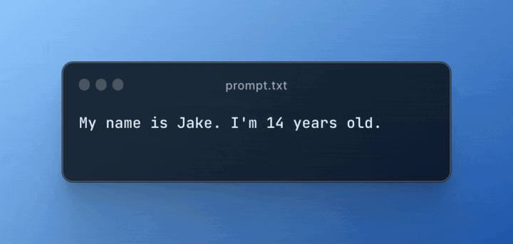

# Instruct Edit


This is a minimal web app that performs image editing using a natural language prompt.

## How it Works
This example builds upon the stock Next.js starter example to create a natural language image editor. The editor works in two steps:
1. Convert natural language to structured image filter settings. For this, we use the [@yusuf/un2structured](https://www.fxn.ai/@yusuf/un2structured) predictor that takes in a `prompt` and a JSON `schema` to generate a JSON object:

    

2. Perform image editing using OpenCV and Python. Here, we don't actually write any code. Instead, we use Function's ability to write code for us, all from a description of what we want the function to do. Head over to [fxn.ai/create](https://fxn.ai/create) and create a new predictor with the following prompt:
    > Create a predictor that accepts an image, a brightness value, contrast value, hue shift value, and saturation value. Each of the brightness, contrast, hue shift, and saturation values should be in range [-1, 1] and should have a default value of 0. The predictor should use OpenCV to edit the input image in order. Finally, the predictor should return the resulting image.

## Setup Instructions
1. Clone this repo.
2. Rename `.env.example` to `.env.local`
3. Login or register on [Function](https://fxn.ai) and generate an access key:
     <br/>
    Then paste the generated access key as the `NEXT_PUBLIC_FXN_ACCESS_KEY` value in your `.env.local` file.
    > ⛔: **Do not publish this website with your access key**. Your key will be publicly viewable.
4. Head over to [fxn.ai/create](https://fxn.ai/create) to create an image editing predictor. Use the prompt from the "How it Works" section above. Once the predictor is active, copy the predictor tag (e.g. `@username/predictor-name`) and paste it as the `NEXT_PUBLIC_EDIT_FXN_TAG` value in your `.env.local` file.
5. Run the Next.js development server:
    ```bash
    # Open a terminal and run the following command
    npm run dev
    ```
    Once you do this, open [localhost:3000](http://localhost:3000) and play around with the editor!

## Useful Links
- [Discover predictors to use in your apps](https://fxn.ai/explore).
- [Join the Function community on Discord](https://fxn.ai/community).
- [Check out Function docs](https://docs.fxn.ai).